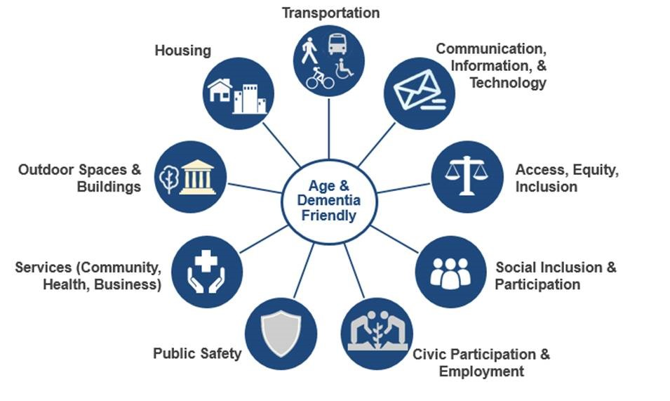

# Needs Assessments

Needs assessments identify key health needs and issues through systematic, comprehensive data collection and analysis.

* Healthcare systems and public health departments produce **community health needs assessment** \(CHNA\) for the residents living within their service area. In Massachusetts, CHNAs are recommended to focus on the community’s physical, social and economic environments to encourage healthy behaviors and improve health. Housing, intertwined with the built, social, and economic environments of neighborhoods, is a health priority of the Massachusetts Department of Health. `i`  Hospitals must conduct a CHNA and propose community health improvement strategies every three years. These assessment and planning processes often include community partners and are intended to guide healthcare system funding decisions.
* **Age Friendly Needs Assessments** are a specific type of needs assessment for cities, towns and regions committed to becoming more Age Friendly via a designation from the World Health Organization and AARP. The commitment aims to convene a variety of municipal departments and community-based organizations to focus on the promotion healthy aging. The “active aging” framework looks at the determinants of active aging \(e.g., social, economic, behavioral, personal, etc.\) along with other age-friendly aspects of communities \(e.g. transportation, housing, social participants, outdoor spaces, etc.\)



`i` _Massachusetts Department of Public Health. \(2017\). Determination of Need Health Priorities Guideline. Retrieved from:_ [_https://www.mass.gov/doc/health-priority-0/download_](https://www.mass.gov/doc/health-priority-0/download)\_\_



