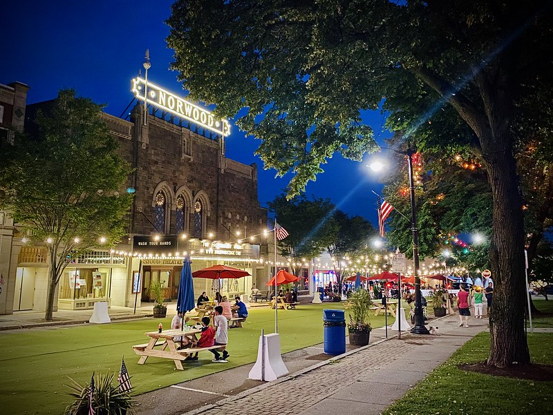

# Placemaking

* **Placemaking** is a collaborative and creative process to help communities transform public spaces. A placemaking approach to mobility seeks out interventions to make streets and sidewalks feel like places to spend time in, rather than spaces simply to move through. 
  * These interventions can lead to improvements in traffic safety and accessibility as well as encourage a sense of community.
  * Placemaking projects are good pilots to test or make the case for policy changes in transportation and community design.

* Placemaking interventions can be permanent adjustments to the built environment to change how people move through spaces, interactive additions to encourage social activity or play, or temporary interventions.`i` 
* Some examples of placemaking include: 
  * sidewalk expansions, conversion of roadway into pedestrian space, and static pieces of public art 
  * exercise facilities, push-button heat lamps, and collaborative digital art 
  * events, performances and farmer’s markets. 



`i` _Project for Public Spaces \(2020\) What is Placemaking?_ [_https://www.pps.org/category/placemaking_ ](https://www.pps.org/category/placemaking/)\_\_



