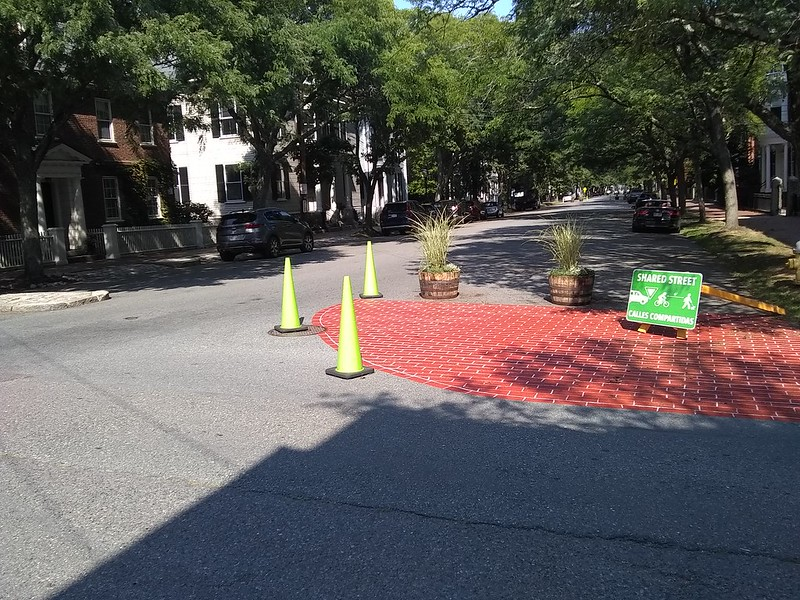

# Traffic Calming

Streets can be made significantly safer for pedestrians and cyclists when traffic volume is reduced and speeds are limited. 

* **Traffic calming** is the term for changes made to existing road conditions that reduce vehicular traffic speeds or volumes to improve safe travel conditions for pedestrians and cyclists.  
* Traffic calming programs include both temporary and permanent measures that change the physical design and restrictions on roads. Traffic calming measures can be implemented at an intersection, street, neighborhood, or area-wide level. Traffic calming programs can also include signal timing and traffic laws, such as variable speed limits, and speed enforcement.`i`


_**Case Example: Municipal 25mph Speed Limit**_ 

In Massachusetts, municipalities have the option to reduce the speed limit from 30 mph to 25mph in thickly settled residential or business districts. 

* This can be done by opting-in to [Massachusetts General Law \(MGL\) c. 90 § 17C](https://malegislature.gov/Laws/GeneralLaws/PartI/TitleXIV/Chapter90/Section17C/). 
* MassDOT recommends municipalities opt-in for all local roads, to avoid potential confusion for drivers. However, cities and towns do have the option to opt-in on a street-by-street basis. 
* Opting in does not change the speed limit for any roads with special speed regulations, nor does it affect speed limits on state highways.  




`i`_U.S. Department of Transportation \(2019\) Traffic Calming to Slow Vehicle Speeds._ [_https://www.transportation.gov/mission/health/Traffic-Calming-to-Slow-Vehicle-Speeds_](https://www.transportation.gov/mission/health/Traffic-Calming-to-Slow-Vehicle-Speeds/)_;_ 



