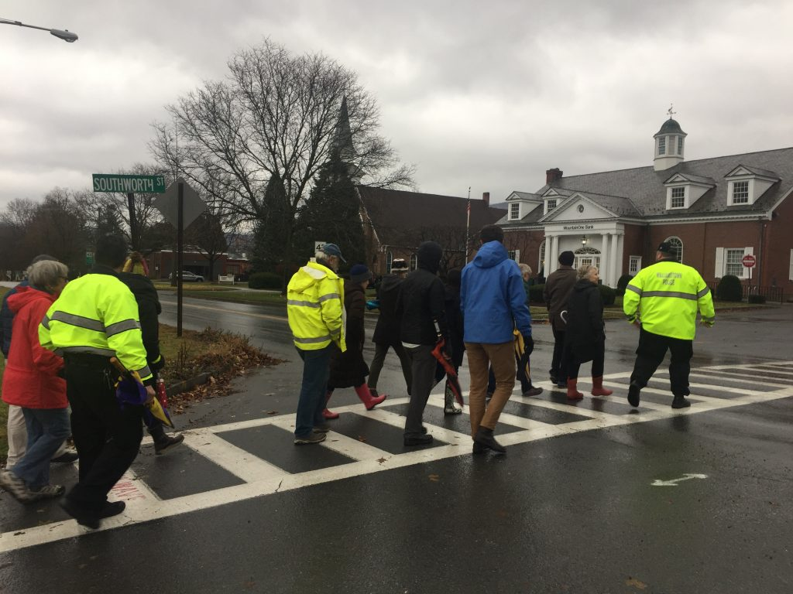

# Safety Assessments

**Walk and Bike Safety Assessments** are processes to gather information on street conditions and the safety, accessibility, and comfort of the environment for walkers and bikers of all ages and abilities. Assessments can vary in focus and size, from an important route or challenging intersection to an entire neighborhood or trail network. `i` 

* A safety assessment can be a great tool for engaging the community or analyzing proposed developments or traffic projects.  
* Safety assessments are most effective when public officials and community members of varying backgrounds, ages and abilities are intentionally invited and welcomed along so they can react to the conditions directly and help identify strategies to ensure that transportation networks meet the needs of all people and are universally accessible. **** 

**Walk Audits** are a common type of safety assessment that evaluates the pedestrian safety, accessibility, and comfort of a particular area. In a walk audit, community members go for a walk together, noting what makes their streets feel comfortable for walking and what is missing. 

* Walk audits can be casual events with just a few friends, or can include city council members, traffic engineers, and detailed forms.  


For Mass in Motion Coordinators and other Massachusetts practitioners, WalkBoston has developed great walk audit resources and should be a first stop for anyone interesting in this mechanism. [Learn more on the WalkBoston website](https://walkboston.org/what-we-do/walkable-communities/).




`i`_Safe Routes to School \(nd\) Walking and Bicycling Audits._ [_http://guide.saferoutesinfo.org_](http://guide.saferoutesinfo.org/)\_\_



