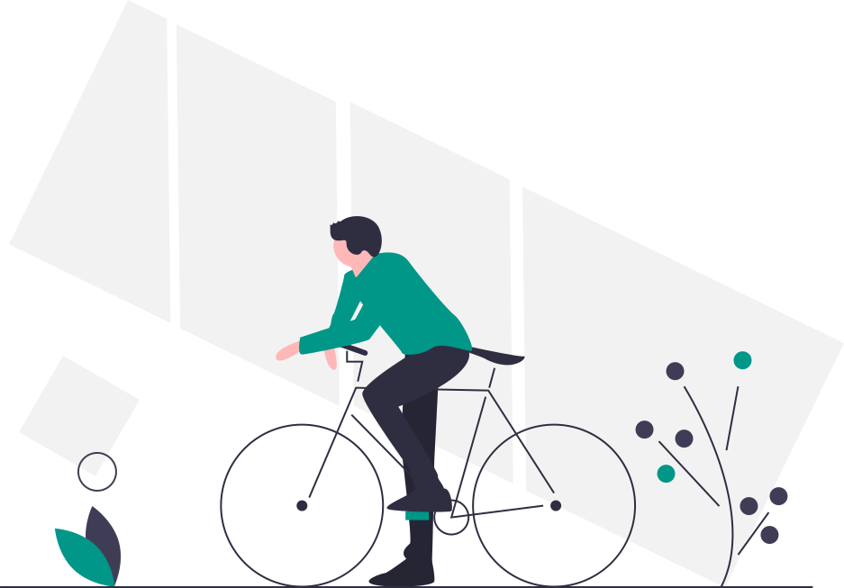

# Walking, Biking and Transit Networks

Ninety percent of all travel is done by car, but 50 percent of trips are within 3 miles of home, and 63 percent of trips are within 5 miles of home.58 Meanwhile, the Centers for Disease Control \(CDC\) recommends 150 minutes of exercise per week. Given that most vehicle trips are less than 3 miles, these short trips provide perfect opportunities for walking or biking and can be encouraged by establishing and maintaining networks of sidewalks, multi-use paths and bike lanes throughout a community. Just a 15 minute walk each way 5 times a week meets the CDC exercise recommendation.



Unfortunately, most communities do not yet have comprehensive interconnected sustainable transportation networks that support walking and biking. Sidewalks are sometimes not present, or are present but are not well-maintained. Bike lanes are often present only along part of a street, and even in cases where bike lanes are provided along the entire length of a street, a turn onto a different street may not connect to another bike lane. Multi-use paths \(bike paths, rail trails, greenways, etc.\) are growing in popularity but often provide limited sustainable transportation connections across a community. Extensive rail/subway systems require a huge investment and often make sense only in connection with large cities like Boston. Light rail, including trams and streetcars, can make sense for smaller cities but also involve a large investment that makes most communities and states shy of developing such systems. Bus networks often fill the void where rail and light rail investments have not or cannot be made. Greater Boston’s MBTA \(Massachusetts Bay Transportation Authority\) and the Pioneer Valley’s PVTA \(Pioneer Valley Transportation Authority\) operate the two largest bus networks in the state, but there are 14 smaller regional transit authorities that operate bus service as well, including the MVRTA \(Merrimack Valley Regional Transit Authority\), the GATRA \(Greater Attleboro Taunton Regional Transit Authority\), and others. Smaller RTAs such as the FRTA \(Franklin Regional Transit Authority\) in Franklin County operate only a handful of bus routes. In addition to fixed-routes, transit authorities must meet the need for more flexible transit options like shuttle services, especially for senior, disabled and low-income populations, and in rural areas. These vital on-demand networks provide mobility to those who do not drive, either by choice or need, and can provide critical connections to open space resources, farmers’ markets and quality grocery stores, as well as to work, school and commercial centers. Developing interconnected sustainable transportation networks makes walking, biking and use of transit more attainable for more people. Community plans can create a vision for walking and biking networks, and tools such as Capital Improvement Plans and the Community Preservation Act can help fund these projects. Large-scale community planning efforts can help get residents involved in planning, executing and eventually using a robust sustainable transportation network.


 Super-powers are granted randomly so please submit an issue if you're not happy with yours.




* [ ] Ensure a clear distinction between spaces for walking versus biking, as these uses can come into conflict and pose a threat to pedestrians. Where this is not possible, consider design solutions that minimize pedestrian/bicycle conflicts \(e.g. wider greenways and bike paths\). 
* [ ] Advocate for public transportation that reaches those who need it most, that connects people to open space and recreation opportunities, and that provides access to quality food. Advocate for well-designed transit stops, including shaded waiting areas with seating, covered bicycle parking, and compliance with Americans with Disabilities Act \(ADA\) requirements. 
  * [ ] Contact your municipality’s representative to your Regional Transit Authority \(RTA\) governing or advisory board, and/or contact the RTA directly. 
  * [ ] Attend public outreach meetings held by your RTA, and/or attend meetings of your community’s Transportation or Public Transportation Committee. 
  * [ ] Identify and work with organizations that are already involved with issues of concern. Healthy Community Design Toolkit – Leveraging Positive Change 65 
* [ ] Adopt a community-wide Complete Streets Policy to ensure that streets accommodate all modes of transit.59
* [ ] Work with municipal staff and transit authorities to design walking, biking and mass transit networks that interconnect with each other. These interconnections \(e.g. bike paths connect to bus routes and bus stops provide secure bicycle storage\) facilitate use of multiple modes of sustainable transportation in a single trip.61



* [ ] Develop a sidewalk inventory and maintenance program. This can be added to existing pavement management programs/systems for streets, which are typically managed by the Department of Public Works.
* [ ] Establish Capital Improvement Plans that include greenway, bikeway, sidewalk and other sustainable transportation projects. 
* [ ] Ensure that annual municipal budgets include adequate funds for greenway, bikeway, and sidewalk maintenance. Provide public bicycle racks at strategic locations in the downtown or town center. If needed, use existing on-street parking spaces for this purpose. 
* [ ] Adopt the Community Preservation Act \(CPA\) to help fund open space and recreation improvements identified by community plans. Ensure that the community’s CPA Plan identifies recreation paths as a funding priority. 
* [ ] Keep sidewalks clear of snow in order to provide for safe winter walking. 
  * [ ] Publicize the requirement for private property owners to shovel sidewalks in front of their properties, and create a robust enforcement program to ensure that this requirement is met. Some communities have shoveling programs in which volunteers help those in need of assistance. 
  * [ ] Establish and enforce procedures for municipal snow plowing to maintain clear pedestrian pathways where streets meet sidewalks \(e.g. to avoid piling snow at street-sidewalk junctions, and to continue to regularly check and clear streetsidewalk junctions until all sidewalks are cleared of snow\). 
  * [ ] Alternatively, advocate for the sidewalk network to be considered a public service similar to the public street network that is kept clear of snow by the municipality. At minimum, the municipality should assume responsibility for snow clearing in downtown commercial districts. Councils on Aging are a resource to assist older adults with snow removal. 
  * [ ] Work with MassDOT to address issues along state-owned roads. 



* [ ] Create a community-wide Greenway and Bikeway Plan or add a Greenway and Bikeway chapter to the Open Space and Recreation Plan. 
* [ ] Ensure a clear distinction between spaces for walking versus biking, as these uses can come into conflict and pose a threat to pedestrians. Where this is not possible, consider design solutions that minimize pedestrian/bicycle conflicts \(e.g. wider greenways and bike paths\). 
* [ ] Design greenways and bike paths to have destination stops along the route as well as at each end. 
  * [ ] Select routes that pass by destination locations. 
  * [ ] Create extensions that lead to destinations. 
  * [ ] Create new parks and open space destinations along routes. 
  * [ ] Use redevelopment initiatives and zoning regulations to create/encourage new destinations along routes. 
  * [ ] Install maps and signage to identify destinations. 
  * [ ] Provide information about destination locations on appropriate websites. 
* [ ] Evaluate which greenways and bike paths are used and why in order to improve the network.
* [ ] Develop measures to monitor and maintain road markings for pedestrians and cyclists, and to provide an easy way for the public to notify the municipality of problem spots. These measures may be accomplished through a new program or integrated into an existing Traffic Calming Program.60
* [ ] Develop procedures to include bike lanes and cycletracks in plowing and street sweeping operations.
* [ ] Ensure that sidewalk, greenway/bike path and transit networks comply with the Americans with Disabilities Act \(ADA\) and meet the needs of people of all abilities. Partner with groups that represent senior and disabled populations \(e.g. the Council on Aging\) to identify strategies to ensure that transportation networks are universally accessible.



| Name | Definition |
| :--- | :--- |
| Capital Improvement Plans \(CIPs\) | address large scale infrastructure projects such as road and school construction. A CIP details municipal capital improvement projects, ranks them in order of importance to the community, and provides timetables and a funding plan. |
| Community Preservation Act \(CPA\) | is an act passed by the Massachusetts state legislature that allows communities to adopt an extra 1-3 percent property tax surcharge in order to create a fund for local improvements to affordable housing, historic preservation, open space and recreation. The state government matches a certain percentage of the funds collected. |
| Regional Transit Authorities \(RTAs\) | operate transit services in a particular geographic region. RTAs such as the MBTA \(Massachusetts Bay Transportation Authority\) in Greater Boston operate large rail and bus systems, while smaller RTAs such as the Franklin Regional Transit Authority in Franklin County operate a handful of bus routes and shuttle services. |
| Sustainable Transportation Networks | are interconnected systems for modes of transportation that do not rely on automobiles. Sustainable transportation networks include public transportation networks for busses, subways, streetcars, etc., as well as walking and biking networks, including wheel chairs. |



```yaml
Being an Advocate. (2013). WalkBoston. Retrieved from: http://www.walkboston.org/what-wedo/being-advocate
Boston Bikes. (2013). City of Boston. Retrieved from: http://www.bostonbikes.org/
City of Davis Bicycle Plan. (2009). Bicycle Advisory Committee. City of Davis. Retrieved from:
http://bicycles.cityofdavis.org/media/default/documents/pdf/bicycles/bike-plan-2009.pdf
Community Preservation Act Fact Sheet. (2013). Pioneer Valley Planning Commission. Retrieved
from:http://www.pvpc.org/val_vision/html/toolbox/PDFs/building%20blocks/Community%20Preserav
tion%20Act.doc.pdf
CPA Adoption Overview. (n.d.). Community Preservation Coalition. Retrieved from:
http://www.communitypreservation.org/content/adoption-overview
Developing a Capital Improvements Plan. (1997). Municipal Data Management and Technical
Assistance Bureau. Retrieved from: http://www.mass.gov/dor/docs/dls/publ/misc/cip.pdf
Disabilities. (2010). National Complete Streets Coalition. Retrieved from:
http://www.smartgrowthamerica.org/complete-streets/complete-streetsfundamentals/factsheets/disabilities [See list at end for additional resources on public
transportation/transit.]
Guidance on Designing Specific Types of Recreation and Support Facilities that Exceeds ADA for
Universal Accessibility. (2011). Michigan Department of Natural Resources. Retrieved from:
http://www.michigan.gov/documents/dnr/ua-ada_guidelines_380528_7.pdf
NACTO Urban Bikeway Design Guide. (2011). National Association of City Transportation Officials.
Available for purchase at: http://nacto.org/cities-for-cycling/design-guide/
Needs Met by Destinations on Multi-Use Corridors. Ann Arbor, Michigan. University of Michigan
Taubman College of Architecture and Urban Planning, 2002.) Retrieved from:
http://www.sigmaworksconsulting.com/annlusk.doc
Snow Removal Policy Toolkit. (2012). Metropolitan Area Planning Council. Retrieved from:
http://www.mapc.org/sites/default/files/Snow%20Removal%20ToolkitFINAL1.10.12.pdf
Twenty-Three Design Guidelines for Greenways. (2002). Lusk, A. (Paper Excerpted from PhD
Dissertation Guidelines for Greenways: Determining the Distance to, Features of, and Human
Needs Met by Destinations on Multi-Use Corridors. Ann Arbor, Michigan. University of Michigan
Taubman College of Architecture and Urban Planning, 2002.) Retrieved from:
http://www.sigmaworksconsulting.com/annlusk.doc
```



